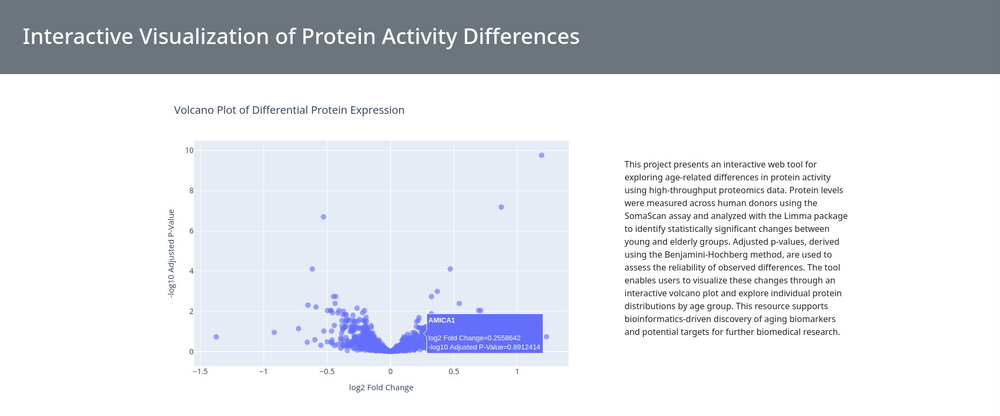
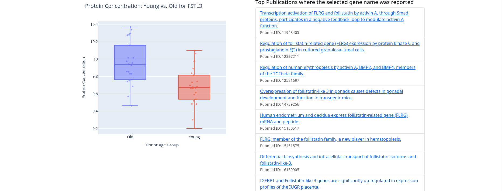

# IVPAD - Interactive Visualization of Protein Activity Differences

IVPAD is a lightweight web application build on Flask that enables interactive exploration of gene and protein expression differences. It is designed to help researchers visualize and explore differences in protein activity levels between different age groups. Using data from the NIHMS1635539 dataset, it provides an interactive way to examine how protein activity varies across young and elderly donors.

The main feature is a volcano plot, which visually represents protein activity with a focus on statistical significance. By clicking on any point in the plot, users can see a boxplot comparing protein concentrations in young versus old donors, offering a deeper understanding of how age impacts protein activity.

The system also enhances the user experience by providing links to scientific papers, offering additional context about the genes and their relevance in the research field. This feature leverages information from MyGene.info to provide users with easy access to related research publications.

This service is intended to assist bioinformaticians, molecular biologists, and other researchers in identifying and understanding key proteins involved in aging, with a clear, data-driven interface to explore the relationships between gene expression and age-related changes in protein activity.




---

## 📦 Features

- 🔬 Interactive volcano plot (Plotly)
- 📊 Boxplot rendering for selected genes
- 📚 Live PubMed publication lookup
- ⚡ Smooth UX with loading indicators
- 📱 Responsive interface using Bootstrap 5

---

## 🔧 Installation & Setup (Conda)

Follow these steps to get the app up and running in a conda environment:

### 1. Clone the repository

```bash
git clone https://github.com/D4S1/ivpad.git
cd ivpad
```

### 2. Create and activate the Conda environment

```bash
conda create -n ivpad python pandas numpy flask requests plotly openpyxl
conda activate ivpad
```

### ✅ Optional: Use an `environment.yml` file instead

If you'd prefer to set everything up from a config file, you can use this:

```yaml
name: ivpad
channels:
  - defaults
dependencies:
  - python
  - pandas
  - numpy
  - flask
  - requests
  - plotly
  - openpyxl
```

Save this as `environment.yml` and run:

```bash
conda env create -f environment.yml
conda activate ivpad
```

---

## 🚀 Running the App

Once everything is set up, launch the Flask server with:

```bash
python app.py
```

Then open your browser and navigate to:

```
http://localhost:5000
```

---

## 🧪 Tech Stack

- **Backend**: Python, Flask
- **Frontend**: HTML, Bootstrap 5, JavaScript
- **Visualization**: Plotly (volcano & box plots)
- **Data Handling**: Pandas, NumPy
- **APIs**:
  - **PubMed** via `requests`
  - **[MyGene.info](https://mygene.info)** for gene annotation and lookup

---

## 📁 Project Structure

```
ivpad/
├── app.py                # Main Flask app
├── utils.py              # Utilities for data handling & plots
├── templates/
│   └── main.html         # Main UI template (Jinja2)
├── environment.yml       # Conda environment definition (optional)
├── .gitignore
└── README.md             # Project documentation
```

---

## 📚 Acknowledgements

- [Plotly](https://plotly.com/python/) – Interactive visualizations
- [Bootstrap](https://getbootstrap.com/) – Frontend styling
- [Flask](https://flask.palletsprojects.com/) – Web backend
- [PubMed](https://pubmed.ncbi.nlm.nih.gov/) – Literature data source
- [MyGene.info](https://mygene.info) – Fast gene annotation and query service

---

## ✅ Future Features

- 🔍 Gene search + filtering
- 📤 Export data/figures
- 📈 Gene set enrichment visualizations


